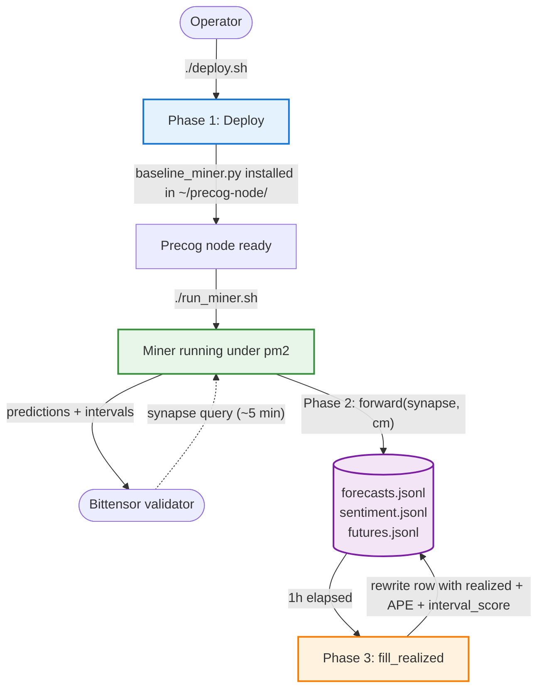
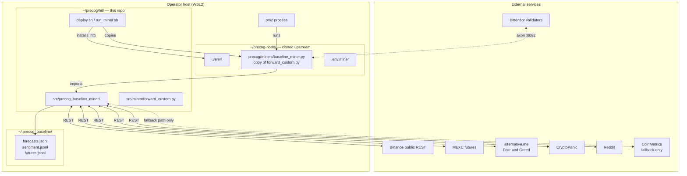

# Overview

The system has three lifecycle phases. **Phase 1 (Deploy)** runs once per host; **Phase 2 (Runtime forecast)** runs every time a Bittensor validator queries the miner (~5 min cadence on testnet); **Phase 3 (Evaluation)** runs an hour after each forecast to back-fill the realized outcome.

For phase-level detail see:

- [Phase 1 — Deploy](./01-deploy.md)
- [Phase 2 — Runtime forecast](./02-runtime-forecast.md)
- [Phase 3 — Evaluation / back-fill](./03-evaluation.md)

---

## Workflow — system lifecycle

---

## Component view — what lives where

---

## Key invariants an engineer should know

- **`forward_custom.py` is the deployed copy's source of truth.** `deploy.sh` copies it into `~/precog-node/precog/miners/baseline_miner.py` — never edit the copy in place.
- **All persistence is append-only JSONL.** Three log files; `fill_realized()` is the *only* function that rewrites rows in place (and only ever to fill `realized_*` / `ape` / `interval_score` fields).
- **Sentiment + futures are non-fatal.** If any sentiment or futures source fails, its signal becomes `None` and the point forecast falls back to pure momentum. The miner never crashes from a missing optional signal.
- **Asset omission ≥ asset garbage.** If both Binance and CoinMetrics fail for an asset, that asset is *omitted* from the response (validators score 0) rather than filled with a guess.
