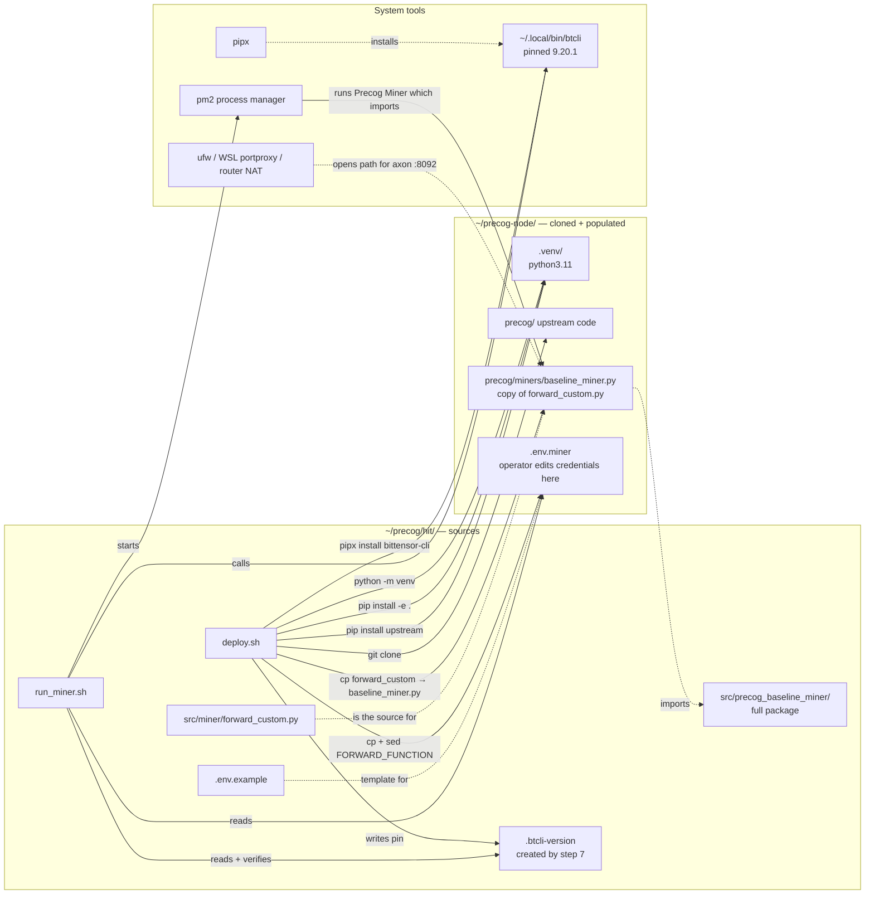

# Phase 1 — Deploy

**What happens:** `deploy.sh` wires this repo's package into a clone of the Precog upstream repo, installs everything into a venv, and copies our forward function to the location where Precog's `Miner` class will dynamically import it. After that, the operator edits `.env.miner`, registers a hotkey on the subnet, opens the axon port, and runs `run_miner.sh`, which performs pre-flight checks before starting the miner under pm2.

**Trigger:** operator, once per host (re-runnable; idempotent on most steps).

**Source:** [`deploy.sh`](../../deploy.sh), [`run_miner.sh`](../../run_miner.sh).

---

## Workflow — `deploy.sh` then first run

```mermaid
flowchart TD
    Start([Operator runs ./deploy.sh]) --> S0

    S0[Step 0/7: pipx + btcli check<br/>install bittensor-cli 9.20.1 if mismatched]
    S1[Step 1/7: git clone Precog upstream<br/>→ ~/precog-node/]
    S2[Step 2/7: python -m venv<br/>→ ~/precog-node/.venv/<br/>prefer python3.11]
    S3[Step 3/7: pip install -e Precog upstream]
    S4[Step 4/7: pip install -e ~/precog/hit<br/>our package]
    S5[Step 5/7: cp src/miner/forward_custom.py<br/>→ ~/precog-node/precog/miners/baseline_miner.py]
    S6[Step 6/7: cp .env.example<br/>→ ~/precog-node/.env.miner<br/>+ sed FORWARD_FUNCTION=baseline_miner]
    S7[Step 7/7: write pinned btcli version<br/>→ .btcli-version]

    S0 --> S1 --> S2 --> S3 --> S4 --> S5 --> S6 --> S7

    S7 --> Edit[Operator edits .env.miner<br/>COLDKEY, MINER_HOTKEY, NETWORK]
    Edit --> Reg[btcli s register --netuid 256<br/>one-time on testnet]
    Reg --> Port[ufw allow 8092/tcp<br/>+ WSL2 portproxy + router NAT]
    Port --> Run([Operator runs ./run_miner.sh])

    Run --> PreFlight{Pre-flight checks}
    PreFlight -->|"verify .btcli-version match"| Check2{TAO balance ≥ MIN_BALANCE_TAO?}
    Check2 -->|"verify hotkey registered on netuid"| Check3{Hotkey registered?}
    Check3 -->|"all pass"| Boot([pm2 starts miner<br/>axon listens on :8092])
    Check3 -.->|"any check fails"| Abort([Abort with error<br/>do not start])

    style S5 fill:#fff3e0,stroke:#f57c00
    style Boot fill:#e8f5e9,stroke:#388e3c,stroke-width:2px
    style Abort fill:#ffebee,stroke:#c62828
```

The highlighted step (5/7) is the load-bearing one — it's why this repo and `~/precog-node/` are coupled.

---

## Component view — files and tools deploy.sh touches

---

## Things to watch for

- **`PRECOG_DIR` env var** lets you point at an existing Precog clone instead of `~/precog-node/`. Useful in CI or when sharing a single node across users.
- **Step 5 is destructive on re-run** — it overwrites `baseline_miner.py` unconditionally. That's intentional: re-running `deploy.sh` is the way to deploy a new version of the forward function.
- **Step 6 is *not* destructive on re-run** — it preserves an existing `.env.miner` (your credentials). If you change `.env.example`, you must manually mirror it.
- **The .btcli-version pin** exists so `run_miner.sh` can refuse to start if the system btcli has drifted from what we tested against. Bump `BTCLI_VERSION` in `deploy.sh` to upgrade.
