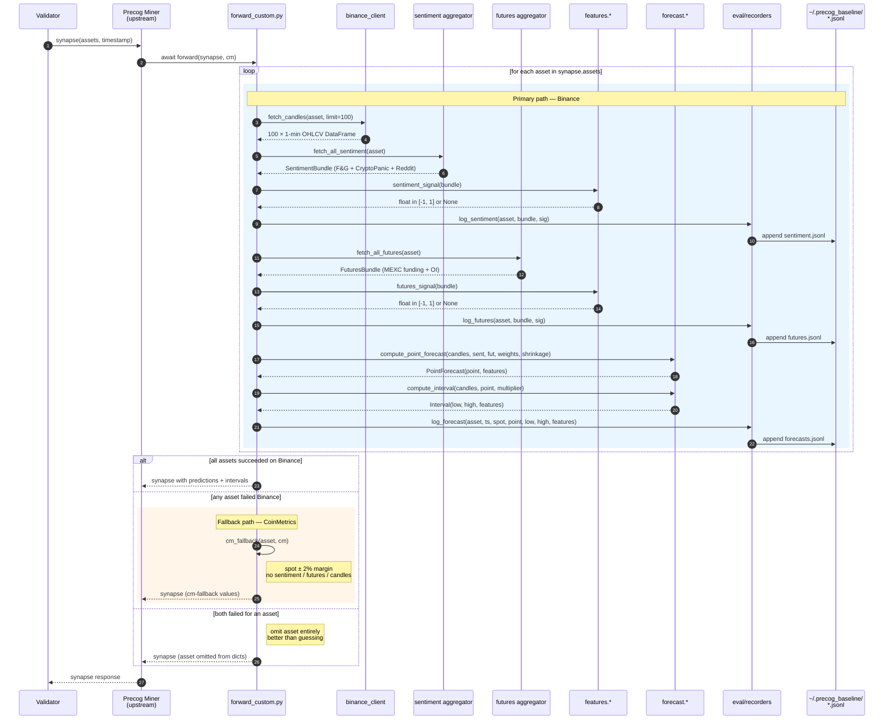
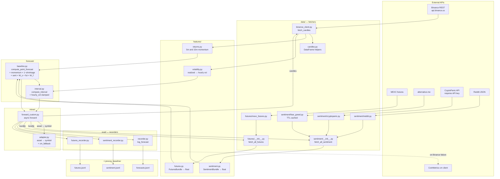

# Phase 2 — Runtime forecast

**What happens:** for every validator query (Bittensor wraps it as a `synapse` object), the Precog `Miner` class dynamically imports our `baseline_miner.py` and calls `forward(synapse, cm)`. We loop over the assets in the request, fetch candles + sentiment + futures, compute the point forecast and interval, log everything to JSONL, and return the populated synapse. A two-tier fallback chain (Binance → CoinMetrics → omit) guarantees we never return garbage.

**Trigger:** Bittensor validator request, ~5 min cadence on testnet.

**Source:** [`src/miner/forward_custom.py`](../../src/miner/forward_custom.py).

This is the most important diagram in the repo — most engineering work touches the runtime path.

---

## Workflow — single validator request, per asset



The shaded sections separate the **primary** (full-feature) and **fallback** (degraded but valid) code paths. Both record some artifact — the primary writes three JSONL rows per asset, the fallback writes none. This is deliberate: fallback rows would pollute the data we use to evaluate signal quality.

---

## Component view — modules used during a forward call



---

## Forecast formula at a glance

```
point = spot × (1 + base_return × (1 − POINT_SHRINKAGE)
                  + sentiment_sig × SENTIMENT_WEIGHT      (if sentiment available)
                  + futures_sig   × FUTURES_WEIGHT)       (if futures available)

base_return = blend(ret_5m, ret_15m)             (in features/returns.py)

interval = [point − vol_halfwidth, point + vol_halfwidth]
vol_halfwidth = hourly_vol × INTERVAL_MULTIPLIER
              clamped to [0.1%, 7.5%] of point
```

`POINT_SHRINKAGE`, `SENTIMENT_WEIGHT`, `FUTURES_WEIGHT`, and `INTERVAL_MULTIPLIER` are all read from env via [`config.py`](../../src/config.py).

---

## Failure semantics

| Failure                       | Effect                                                                    |
|-------------------------------|---------------------------------------------------------------------------|
| Sentiment source fails        | That source's contribution drops to 0; bundle re-normalizes proportionally |
| All sentiment sources fail    | `sentiment_sig = None` → falls out of the point formula                    |
| Futures fetch fails           | `futures_sig = None` → falls out of the point formula                      |
| Binance fails for one asset   | Fall through to CoinMetrics fallback (point = spot, interval = spot ± 2%) |
| CoinMetrics also fails        | Asset is **omitted** from response (better than garbage)                   |
| Forecast/interval throws      | Caught at the outer try; treated as Binance failure → CM fallback          |

The single rule: **never return a number we don't believe in**. Validators score missing assets at zero reward, but they score *bad* numbers more harshly through APE — so omission dominates fabrication.
