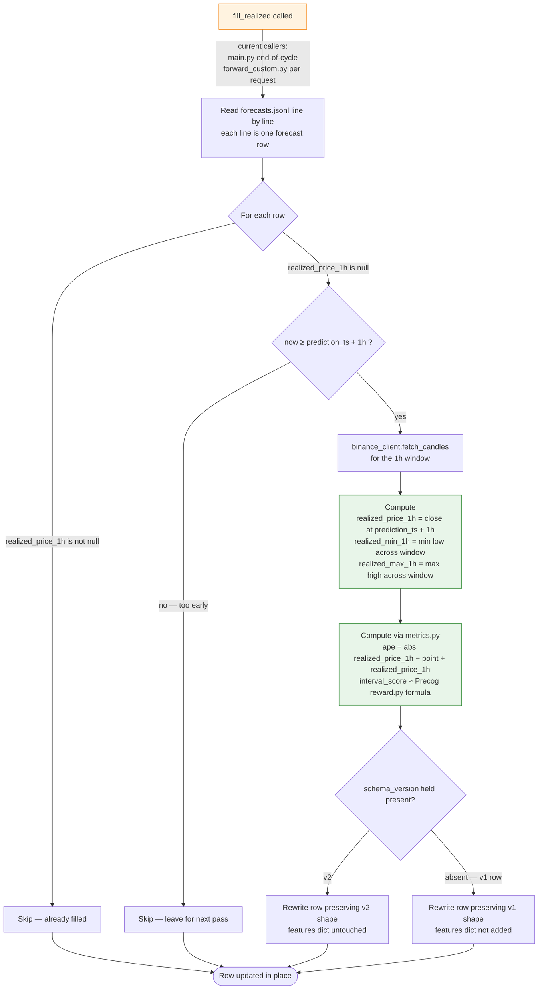
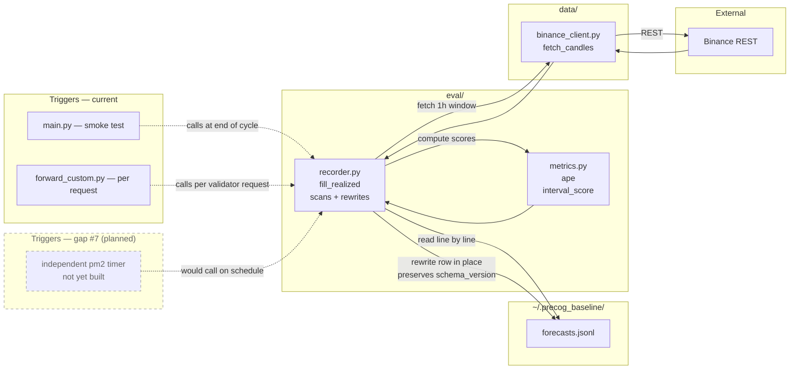

# Phase 3 — Evaluation / back-fill

**What happens:** an hour after each forecast is logged, we want to know what *actually* happened. `fill_realized()` walks `forecasts.jsonl`, finds rows whose 1-hour horizon has elapsed but whose `realized_price_1h` field is still `null`, fetches the realized 1h candle window from Binance, and rewrites those rows in place to add `realized_price_1h`, `realized_min_1h`, `realized_max_1h`, `ape`, and `interval_score`.

**Trigger:** *currently* piggybacks on `forward()` and `main.py` — there is no independent timer. This is **gap #7** in the project memory: when validators go quiet, back-fill lags. A future independent pm2 timer would close this gap.

**Source:** [`src/eval/recorder.py`](../../src/eval/recorder.py), [`src/eval/metrics.py`](../../src/eval/metrics.py).

---

## Workflow — `fill_realized()` pass

---

## Component view — back-fill data flow

The dashed-border `future` subgraph is gap #7 — not yet implemented. When built, it removes the dependency on validator queries to drive back-fill.

---

## Schema invariants

`fill_realized()` is the **only** code path that rewrites a row in `forecasts.jsonl`. It writes exactly these fields:

| Field                | Source                              | Type       |
|----------------------|-------------------------------------|------------|
| `realized_price_1h`  | Binance close at prediction_ts + 1h | float      |
| `realized_min_1h`    | min low across 1h window            | float      |
| `realized_max_1h`    | max high across 1h window           | float      |
| `ape`                | `metrics.ape(realized, point)`      | float      |
| `interval_score`     | `metrics.interval_score(...)`       | float      |

It must **never** modify `point`, `low`, `high`, `spot`, `features`, or any timestamp field. If you find yourself wanting to do that, write a new ADR — you're proposing a schema migration, not a back-fill change.

The function tolerates **both** schema versions:

- **v2 rows** — have `schema_version: "v2"` and a `features` dict; rewritten with that shape preserved.
- **v1 rows** (pre-Phase-1, before features were captured) — lack both fields; rewritten without adding them. Don't backfill `features` retroactively — those values are lost.
